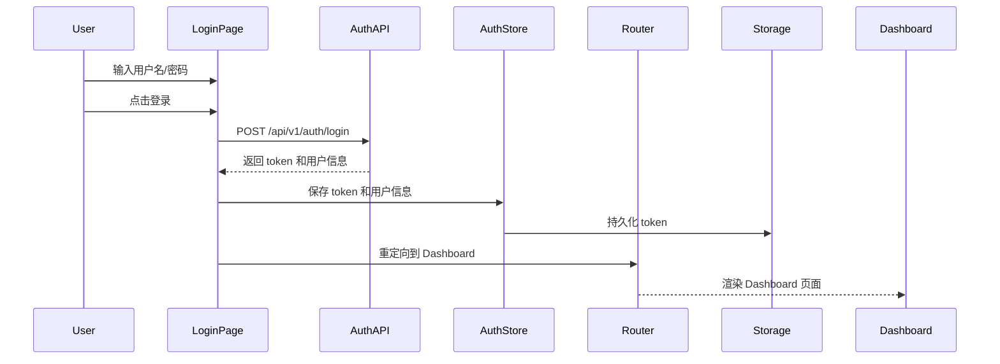
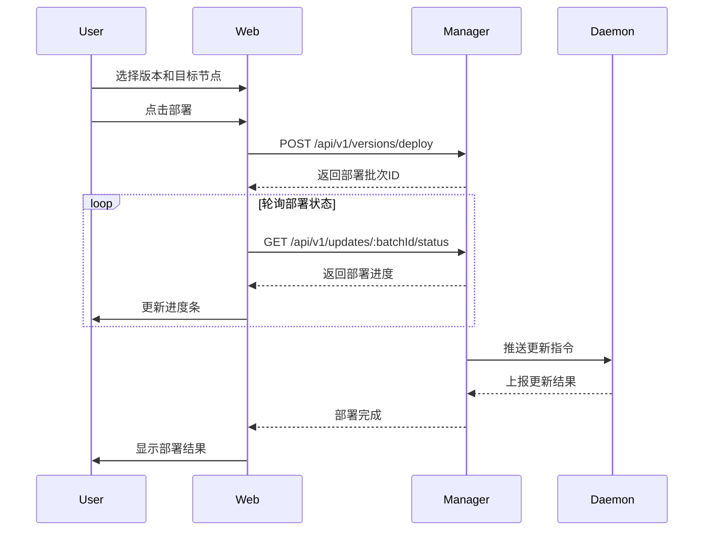

# 设计文档 04 - Web 前端模块

**项目名称：** Ops Scaffold Framework - Web Frontend
**文档版本：** 1.0
**创建日期：** 2025-12-03
**文档状态：** 草稿

---

## 目录

1. [模块概述](#1-模块概述)
2. [技术架构](#2-技术架构)
3. [功能设计](#3-功能设计)
4. [界面设计](#4-界面设计)
5. [状态管理](#5-状态管理)
6. [API 集成](#6-api-集成)
7. [性能优化](#7-性能优化)
8. [安全设计](#8-安全设计)
9. [部署方案](#9-部署方案)
10. [测试方案](#10-测试方案)

---

## 1. 模块概述

### 1.1 功能定位

Web 前端模块是 Ops Scaffold Framework 的可视化操作界面,为运维人员提供:
- 集中化的节点管理
- 可视化的监控仪表盘
- 便捷的任务执行和调度
- 安全的版本发布和回滚
- 完善的用户权限管理

### 1.2 核心功能

| 功能模块 | 功能描述 | 优先级 |
|---------|---------|--------|
| 用户认证 | 登录、登出、自动登录 | P0 |
| Dashboard | 节点统计、资源趋势图、告警列表 | P0 |
| 节点管理 | 节点列表、详情、监控、筛选 | P0 |
| 任务管理 | 任务创建、执行、历史查询 | P0 |
| 版本管理 | 版本上传、部署、回滚 | P1 |
| 系统管理 | 用户管理、审计日志、设置 | P1 |

### 1.3 设计目标

**性能目标**:
- 首屏加载时间 < 3s
- 页面交互响应 < 100ms
- 构建体积 < 2MB (gzip)
- Lighthouse 性能得分 > 90

**用户体验**:
- 界面简洁直观
- 操作流畅自然
- 错误提示友好
- 支持移动端访问

**可维护性**:
- 组件化开发
- TypeScript 类型安全
- 代码规范统一
- 文档完整清晰

---

## 2. 技术架构

### 2.1 技术栈选择

#### 核心技术

```yaml
前端框架:
  - React 18.2+           # 成熟稳定,生态丰富
  - TypeScript 5.0+       # 类型安全,开发效率高

构建工具:
  - Vite 5.0+             # 快速的开发服务器和构建工具
  - ESBuild               # 高性能的打包工具

UI 组件库:
  - Material-UI 5.14+     # 完整的 Material Design 组件库
  - Emotion               # CSS-in-JS 解决方案

路由管理:
  - React Router 6.18+    # 官方推荐的路由库

状态管理:
  - Zustand 4.4+          # 轻量级状态管理
  - React Query 5.0+      # 服务端状态管理和缓存

HTTP 客户端:
  - Axios 1.6+            # 成熟的 HTTP 客户端

数据可视化:
  - Apache ECharts 5.4+   # 功能强大的图表库
  - echarts-for-react     # ECharts 的 React 封装

表单处理:
  - React Hook Form 7.48+ # 高性能表单库

工具库:
  - lodash-es 4.17+       # 工具函数库
  - dayjs 1.11+           # 日期处理库
```

### 2.2 项目架构

#### 2.2.1 分层架构

```
┌─────────────────────────────────────────────────┐
│            Presentation Layer (展示层)           │
│   ┌──────────────────────────────────────────┐  │
│   │    Pages (页面组件)                       │  │
│   │    - Dashboard, Nodes, Tasks, etc.      │  │
│   └──────────────────────────────────────────┘  │
└─────────────────────────────────────────────────┘
                        ↓
┌─────────────────────────────────────────────────┐
│         Component Layer (组件层)                │
│   ┌────────────┬────────────┬────────────────┐  │
│   │  Layout    │  Business  │    Common      │  │
│   │  组件      │  组件      │    组件        │  │
│   └────────────┴────────────┴────────────────┘  │
└─────────────────────────────────────────────────┘
                        ↓
┌─────────────────────────────────────────────────┐
│          Business Layer (业务层)                │
│   ┌────────────┬────────────┬────────────────┐  │
│   │  Hooks     │   Stores   │    Utils       │  │
│   │  自定义钩子 │   状态管理 │    工具函数    │  │
│   └────────────┴────────────┴────────────────┘  │
└─────────────────────────────────────────────────┘
                        ↓
┌─────────────────────────────────────────────────┐
│           Data Layer (数据层)                   │
│   ┌────────────────────────────────────────┐    │
│   │    API Services (API 服务)             │    │
│   │    - HTTP Client, Interceptors         │    │
│   └────────────────────────────────────────┘    │
└─────────────────────────────────────────────────┘
```

#### 2.2.2 目录结构

```
web/
├── public/                         # 静态资源
│   ├── favicon.ico
│   ├── logo.png
│   └── manifest.json
│
├── src/
│   ├── api/                        # API 接口层
│   │   ├── client.ts               # Axios 实例配置
│   │   ├── interceptors.ts         # 请求/响应拦截器
│   │   ├── auth.ts                 # 认证 API
│   │   ├── nodes.ts                # 节点 API
│   │   ├── metrics.ts              # 监控 API
│   │   ├── tasks.ts                # 任务 API
│   │   ├── versions.ts             # 版本 API
│   │   └── users.ts                # 用户 API
│   │
│   ├── components/                 # 组件目录
│   │   ├── Layout/                 # 布局组件
│   │   │   ├── MainLayout.tsx
│   │   │   ├── Sidebar.tsx
│   │   │   ├── Header.tsx
│   │   │   ├── Breadcrumb.tsx
│   │   │   └── index.ts
│   │   ├── Charts/                 # 图表组件
│   │   │   ├── LineChart.tsx
│   │   │   ├── PieChart.tsx
│   │   │   ├── BarChart.tsx
│   │   │   └── index.ts
│   │   ├── Table/                  # 表格组件
│   │   │   ├── DataTable.tsx
│   │   │   ├── Pagination.tsx
│   │   │   └── index.ts
│   │   └── Common/                 # 通用组件
│   │       ├── Loading.tsx
│   │       ├── ErrorBoundary.tsx
│   │       ├── ConfirmDialog.tsx
│   │       ├── EmptyState.tsx
│   │       └── index.ts
│   │
│   ├── pages/                      # 页面组件
│   │   ├── Login/                  # 登录页
│   │   │   ├── index.tsx
│   │   │   └── styles.ts
│   │   ├── Dashboard/              # 仪表盘
│   │   │   ├── index.tsx
│   │   │   ├── StatCards.tsx
│   │   │   ├── NodeStatusChart.tsx
│   │   │   ├── MetricsTrend.tsx
│   │   │   └── styles.ts
│   │   ├── Nodes/                  # 节点管理
│   │   │   ├── List.tsx
│   │   │   ├── Detail.tsx
│   │   │   ├── Metrics.tsx
│   │   │   └── index.ts
│   │   ├── Tasks/                  # 任务管理
│   │   │   ├── List.tsx
│   │   │   ├── Create.tsx
│   │   │   ├── History.tsx
│   │   │   └── index.ts
│   │   ├── Versions/               # 版本管理
│   │   │   ├── List.tsx
│   │   │   ├── Upload.tsx
│   │   │   ├── Deploy.tsx
│   │   │   └── index.ts
│   │   └── System/                 # 系统管理
│   │       ├── Users.tsx
│   │       ├── AuditLogs.tsx
│   │       ├── Settings.tsx
│   │       └── index.ts
│   │
│   ├── stores/                     # 状态管理
│   │   ├── authStore.ts            # 认证状态
│   │   ├── userStore.ts            # 用户状态
│   │   ├── configStore.ts          # 配置状态
│   │   └── index.ts
│   │
│   ├── hooks/                      # 自定义 Hooks
│   │   ├── useAuth.ts              # 认证 Hook
│   │   ├── useNodes.ts             # 节点数据 Hook
│   │   ├── useTasks.ts             # 任务数据 Hook
│   │   ├── useMetrics.ts           # 监控数据 Hook
│   │   └── index.ts
│   │
│   ├── types/                      # TypeScript 类型定义
│   │   ├── api.ts                  # API 响应类型
│   │   ├── node.ts                 # 节点类型
│   │   ├── task.ts                 # 任务类型
│   │   ├── user.ts                 # 用户类型
│   │   ├── metric.ts               # 指标类型
│   │   └── index.ts
│   │
│   ├── utils/                      # 工具函数
│   │   ├── format.ts               # 格式化工具
│   │   ├── validation.ts           # 验证工具
│   │   ├── storage.ts              # 本地存储工具
│   │   ├── request.ts              # 请求工具
│   │   └── index.ts
│   │
│   ├── config/                     # 配置文件
│   │   ├── constants.ts            # 常量配置
│   │   ├── env.ts                  # 环境变量
│   │   └── index.ts
│   │
│   ├── styles/                     # 样式文件
│   │   ├── theme.ts                # MUI 主题配置
│   │   ├── global.css              # 全局样式
│   │   └── variables.css           # CSS 变量
│   │
│   ├── router/                     # 路由配置
│   │   ├── index.tsx               # 路由入口
│   │   ├── routes.tsx              # 路由定义
│   │   └── guards.tsx              # 路由守卫
│   │
│   ├── App.tsx                     # 根组件
│   ├── main.tsx                    # 入口文件
│   └── vite-env.d.ts               # Vite 类型声明
│
├── .env.development                # 开发环境变量
├── .env.production                 # 生产环境变量
├── .eslintrc.cjs                   # ESLint 配置
├── .prettierrc                     # Prettier 配置
├── tsconfig.json                   # TypeScript 配置
├── tsconfig.node.json              # Node TypeScript 配置
├── vite.config.ts                  # Vite 配置
├── package.json                    # 依赖配置
└── README.md                       # 说明文档
```

### 2.3 技术决策

#### 2.3.1 为什么选择 React?

| 优势 | 说明 |
|------|------|
| 生态成熟 | 丰富的第三方库和工具链 |
| 性能优秀 | Virtual DOM 和 Fiber 架构 |
| 学习曲线 | 概念简单,易于上手 |
| 社区活跃 | 大量学习资源和最佳实践 |
| TypeScript 支持 | 官方类型定义完善 |

#### 2.3.2 为什么选择 Vite?

| 优势 | 说明 |
|------|------|
| 启动速度快 | 基于 ESBuild,秒级冷启动 |
| HMR 性能高 | 模块级热更新 |
| 配置简单 | 开箱即用,约定优于配置 |
| 构建优化 | Rollup 构建,产物优化 |
| 插件丰富 | 兼容 Rollup 插件生态 |

#### 2.3.3 为什么选择 Material-UI?

| 优势 | 说明 |
|------|------|
| 组件完整 | 覆盖所有常用组件 |
| 主题系统 | 强大的主题定制能力 |
| 响应式设计 | 内置响应式断点系统 |
| 无障碍性 | 良好的 a11y 支持 |
| 文档完善 | 详细的文档和示例 |

#### 2.3.4 为什么选择 Zustand?

| 优势 | 说明 |
|------|------|
| 轻量级 | 仅 1KB,无样板代码 |
| 简单易用 | API 简洁直观 |
| 性能优秀 | 精确订阅,避免不必要渲染 |
| TypeScript | 完美的类型推导 |
| 中间件 | 支持 devtools、persist 等 |

---

## 3. 功能设计

### 3.1 用户认证模块

#### 3.1.1 登录流程



#### 3.1.2 认证状态管理

```typescript
// authStore.ts
interface AuthState {
  token: string | null
  user: User | null
  isAuthenticated: boolean

  // Actions
  login: (token: string, user: User) => void
  logout: () => void
  refreshToken: () => Promise<void>
}

export const useAuthStore = create<AuthState>(
  persist(
    (set, get) => ({
      token: null,
      user: null,
      isAuthenticated: false,

      login: (token, user) => {
        set({ token, user, isAuthenticated: true })
        storage.setToken(token)
      },

      logout: () => {
        set({ token: null, user: null, isAuthenticated: false })
        storage.removeToken()
      },

      refreshToken: async () => {
        const { token } = get()
        if (!token) return

        try {
          const newToken = await authAPI.refreshToken(token)
          set({ token: newToken })
          storage.setToken(newToken)
        } catch (error) {
          get().logout()
        }
      },
    }),
    {
      name: 'auth-storage',
      partialize: (state) => ({ token: state.token }),
    }
  )
)
```

#### 3.1.3 路由守卫

```typescript
// guards.tsx
import { Navigate, useLocation } from 'react-router-dom'
import { useAuthStore } from '@/stores/authStore'

export const AuthGuard: React.FC<{ children: React.ReactNode }> = ({ children }) => {
  const { isAuthenticated } = useAuthStore()
  const location = useLocation()

  if (!isAuthenticated) {
    return <Navigate to="/login" state={{ from: location }} replace />
  }

  return <>{children}</>
}

export const GuestGuard: React.FC<{ children: React.ReactNode }> = ({ children }) => {
  const { isAuthenticated } = useAuthStore()

  if (isAuthenticated) {
    return <Navigate to="/" replace />
  }

  return <>{children}</>
}
```

### 3.2 Dashboard 模块

#### 3.2.1 统计卡片

**需求**: 展示节点总数、在线节点、离线节点、任务总数

**组件设计**:
```typescript
interface StatCardProps {
  title: string
  value: number
  change?: number        // 相比昨天的变化
  icon: React.ReactNode
  color: string
  loading?: boolean
}

export const StatCard: React.FC<StatCardProps> = ({
  title, value, change, icon, color, loading
}) => {
  // 实现统计卡片UI
}
```

#### 3.2.2 节点状态图

**需求**: 使用饼图展示节点在线/离线状态分布

**技术实现**:
```typescript
import ReactECharts from 'echarts-for-react'

export const NodeStatusChart: React.FC = () => {
  const { data, isLoading } = useNodeStatistics()

  const option = {
    title: { text: '节点状态分布' },
    tooltip: { trigger: 'item' },
    series: [
      {
        name: '节点状态',
        type: 'pie',
        radius: ['40%', '70%'],
        avoidLabelOverlap: false,
        data: [
          { value: data.online, name: '在线', itemStyle: { color: '#52c41a' } },
          { value: data.offline, name: '离线', itemStyle: { color: '#ff4d4f' } },
        ],
      },
    ],
  }

  return <ReactECharts option={option} loading={isLoading} />
}
```

#### 3.2.3 资源趋势图

**需求**: 展示最近 24 小时的 CPU、内存使用率趋势

**技术实现**:
```typescript
export const MetricsTrend: React.FC = () => {
  const { data, isLoading } = useMetricsTrend({ hours: 24 })

  const option = {
    title: { text: '资源使用趋势' },
    tooltip: { trigger: 'axis' },
    legend: { data: ['CPU', '内存'] },
    xAxis: { type: 'time' },
    yAxis: { type: 'value', max: 100, axisLabel: { formatter: '{value}%' } },
    series: [
      {
        name: 'CPU',
        type: 'line',
        data: data.cpu,
        smooth: true,
        itemStyle: { color: '#1890ff' },
      },
      {
        name: '内存',
        type: 'line',
        data: data.memory,
        smooth: true,
        itemStyle: { color: '#52c41a' },
      },
    ],
  }

  return <ReactECharts option={option} loading={isLoading} />
}
```

### 3.3 节点管理模块

#### 3.3.1 节点列表

**功能需求**:
- 分页展示节点列表
- 支持按状态筛选 (全部/在线/离线)
- 支持关键字搜索 (节点名称、IP)
- 支持按标签筛选
- 展示节点基本信息 (名称、IP、OS、状态、最后心跳时间)

**组件设计**:
```typescript
interface NodeListProps {
  // 筛选条件
  filters: {
    status?: 'online' | 'offline'
    search?: string
    labels?: string[]
  }
  // 分页
  page: number
  pageSize: number
}

export const NodeList: React.FC<NodeListProps> = ({ filters, page, pageSize }) => {
  const { data, isLoading } = useNodes({ ...filters, page, pageSize })

  return (
    <Box>
      {/* 筛选栏 */}
      <NodeFilters filters={filters} onChange={handleFiltersChange} />

      {/* 节点表格 */}
      <DataTable
        columns={nodeColumns}
        data={data.list}
        loading={isLoading}
        onRowClick={handleRowClick}
      />

      {/* 分页器 */}
      <Pagination
        total={data.total}
        page={page}
        pageSize={pageSize}
        onChange={handlePageChange}
      />
    </Box>
  )
}
```

#### 3.3.2 节点详情

**功能需求**:
- 展示节点基本信息
- 展示节点实时指标 (CPU、内存、磁盘、网络)
- 展示节点标签
- 展示 Daemon 和 Agent 版本信息

**页面布局**:
```
┌─────────────────────────────────────────────────┐
│  返回    节点详情 - node-001                     │
├─────────────────────────────────────────────────┤
│                                                  │
│  ┌────────────────┐  ┌────────────────────┐     │
│  │  基本信息      │  │  实时指标           │     │
│  │  - 主机名      │  │  - CPU: 45%         │     │
│  │  - IP地址      │  │  - 内存: 60%        │     │
│  │  - 操作系统    │  │  - 磁盘: 70%        │     │
│  │  - 架构        │  │  - 网络: 100 MB/s   │     │
│  │  - 状态        │  │                     │     │
│  │  - 最后心跳    │  │                     │     │
│  └────────────────┘  └────────────────────┘     │
│                                                  │
│  ┌──────────────────────────────────────────┐   │
│  │  历史指标                                │   │
│  │  [CPU趋势图]                             │   │
│  │  [内存趋势图]                            │   │
│  └──────────────────────────────────────────┘   │
│                                                  │
└─────────────────────────────────────────────────┘
```

#### 3.3.3 节点监控

**功能需求**:
- 实时刷新节点指标 (每 30 秒)
- 支持时间范围选择 (1小时/6小时/24小时/7天)
- 支持指标类型选择 (CPU/内存/磁盘/网络)
- 图表可交互 (缩放、数据点查看)

**技术实现**:
```typescript
export const NodeMetrics: React.FC<{ nodeId: string }> = ({ nodeId }) => {
  const [timeRange, setTimeRange] = useState('24h')
  const [metricType, setMetricType] = useState<MetricType>('cpu')

  // 使用 React Query 自动刷新
  const { data, isLoading } = useNodeMetrics(
    { nodeId, timeRange, type: metricType },
    { refetchInterval: 30000 } // 30秒刷新一次
  )

  return (
    <Box>
      {/* 控制栏 */}
      <Stack direction="row" spacing={2}>
        <TimeRangeSelector value={timeRange} onChange={setTimeRange} />
        <MetricTypeSelector value={metricType} onChange={setMetricType} />
      </Stack>

      {/* 图表 */}
      <MetricsChart data={data} type={metricType} loading={isLoading} />
    </Box>
  )
}
```

### 3.4 任务管理模块

#### 3.4.1 任务创建

**功能需求**:
- 支持 3 种任务类型 (脚本执行、文件操作、服务管理)
- 目标节点选择 (全部节点/指定节点/按标签筛选)
- 任务参数配置
- 表单验证

**表单设计**:
```typescript
interface TaskFormData {
  name: string
  type: 'script' | 'file' | 'service'
  targetType: 'all' | 'selected' | 'labels'
  targetNodes?: string[]
  targetLabels?: string[]
  content: {
    // 脚本类型
    script?: string
    scriptType?: 'shell' | 'python'
    // 文件类型
    action?: 'upload' | 'download' | 'delete'
    path?: string
    fileContent?: string
    // 服务类型
    service?: string
    operation?: 'start' | 'stop' | 'restart'
  }
  timeout?: number
}

export const TaskCreate: React.FC = () => {
  const { control, handleSubmit, watch } = useForm<TaskFormData>()
  const taskType = watch('type')

  const onSubmit = async (data: TaskFormData) => {
    await createTask(data)
    navigate('/tasks')
  }

  return (
    <form onSubmit={handleSubmit(onSubmit)}>
      {/* 基本信息 */}
      <TextField label="任务名称" {...register('name')} required />
      <Select label="任务类型" {...register('type')} required />

      {/* 目标节点 */}
      <TargetSelector control={control} />

      {/* 任务参数 (根据类型动态渲染) */}
      {taskType === 'script' && <ScriptParams control={control} />}
      {taskType === 'file' && <FileParams control={control} />}
      {taskType === 'service' && <ServiceParams control={control} />}

      {/* 高级选项 */}
      <TextField label="超时时间(秒)" {...register('timeout')} type="number" />

      <Button type="submit">创建任务</Button>
    </form>
  )
}
```

#### 3.4.2 任务执行历史

**功能需求**:
- 展示任务执行记录
- 显示执行状态 (pending/running/success/failed)
- 查看执行日志
- 支持重新执行
- 支持导出结果

**组件设计**:
```typescript
export const TaskHistory: React.FC<{ taskId: string }> = ({ taskId }) => {
  const { data, isLoading } = useTaskExecutions(taskId)

  const columns = [
    { field: 'id', headerName: 'ID', width: 100 },
    { field: 'createdAt', headerName: '执行时间', width: 180 },
    { field: 'status', headerName: '状态', width: 120, renderCell: StatusBadge },
    { field: 'targetNodes', headerName: '目标节点数', width: 120 },
    { field: 'successCount', headerName: '成功数', width: 100 },
    { field: 'failedCount', headerName: '失败数', width: 100 },
    {
      field: 'actions',
      headerName: '操作',
      width: 200,
      renderCell: (params) => (
        <>
          <Button onClick={() => viewLogs(params.row.id)}>查看日志</Button>
          <Button onClick={() => reExecute(params.row.taskId)}>重新执行</Button>
        </>
      ),
    },
  ]

  return <DataTable columns={columns} data={data} loading={isLoading} />
}
```

### 3.5 版本管理模块

#### 3.5.1 版本上传

**功能需求**:
- 选择组件类型 (Daemon/Agent)
- 上传版本文件 (.tar.gz)
- 填写版本号和描述
- 自动计算文件哈希

**表单设计**:
```typescript
interface VersionUploadForm {
  component: 'daemon' | 'agent'
  version: string
  description: string
  file: File
}

export const VersionUpload: React.FC = () => {
  const { control, handleSubmit, watch } = useForm<VersionUploadForm>()
  const [uploading, setUploading] = useState(false)
  const [progress, setProgress] = useState(0)

  const onSubmit = async (data: VersionUploadForm) => {
    setUploading(true)

    const formData = new FormData()
    formData.append('component', data.component)
    formData.append('version', data.version)
    formData.append('description', data.description)
    formData.append('file', data.file)

    await uploadVersion(formData, {
      onUploadProgress: (event) => {
        const percent = Math.round((event.loaded * 100) / event.total)
        setProgress(percent)
      },
    })

    setUploading(false)
    navigate('/versions')
  }

  return (
    <form onSubmit={handleSubmit(onSubmit)}>
      <Select label="组件类型" {...register('component')} required />
      <TextField label="版本号" {...register('version')} required />
      <TextField label="描述" {...register('description')} multiline rows={3} />
      <FileUpload {...register('file')} accept=".tar.gz" required />

      {uploading && <LinearProgress variant="determinate" value={progress} />}

      <Button type="submit" disabled={uploading}>
        {uploading ? '上传中...' : '上传版本'}
      </Button>
    </form>
  )
}
```

#### 3.5.2 版本部署

**功能需求**:
- 选择要部署的版本
- 选择目标节点
- 选择部署策略 (全量/灰度)
- 实时展示部署进度

**部署流程**:


### 3.6 系统管理模块

#### 3.6.1 用户管理

**功能需求**:
- 用户列表展示
- 创建新用户
- 禁用/启用用户
- 修改用户角色

#### 3.6.2 审计日志

**功能需求**:
- 记录所有管理操作
- 支持多条件筛选 (用户、操作类型、时间范围)
- 展示操作详情

#### 3.6.3 系统设置

**功能需求**:
- 修改系统配置
- 主题切换 (明亮/暗黑)
- 语言切换 (中文/英文)

---

## 4. 界面设计

### 4.1 设计原则

1. **一致性**: 统一的视觉风格和交互模式
2. **简洁性**: 界面简洁,减少认知负担
3. **可用性**: 易于理解和操作
4. **反馈性**: 及时的操作反馈
5. **容错性**: 友好的错误提示和恢复机制

### 4.2 颜色规范

```typescript
// theme.ts
export const theme = createTheme({
  palette: {
    primary: {
      main: '#1890ff',      // 主色调 - 蓝色
      light: '#40a9ff',
      dark: '#096dd9',
    },
    secondary: {
      main: '#52c41a',      // 辅助色 - 绿色
      light: '#73d13d',
      dark: '#389e0d',
    },
    error: {
      main: '#ff4d4f',      // 错误 - 红色
      light: '#ff7875',
      dark: '#cf1322',
    },
    warning: {
      main: '#faad14',      // 警告 - 橙色
      light: '#ffc53d',
      dark: '#d48806',
    },
    info: {
      main: '#1890ff',      // 信息 - 蓝色
    },
    success: {
      main: '#52c41a',      # 成功 - 绿色
    },
    text: {
      primary: 'rgba(0, 0, 0, 0.87)',
      secondary: 'rgba(0, 0, 0, 0.6)',
      disabled: 'rgba(0, 0, 0, 0.38)',
    },
    background: {
      default: '#f0f2f5',
      paper: '#ffffff',
    },
  },
})
```

### 4.3 布局设计

#### 4.3.1 主布局

```
┌───────────────────────────────────────────────────┐
│  Header (60px)                                    │
│  [Logo] [Title]              [User] [Notifications]│
├──────────┬────────────────────────────────────────┤
│          │                                         │
│ Sidebar  │  Content Area                          │
│ (240px)  │                                         │
│          │                                         │
│ - Dashboard                                       │
│ - 节点管理  │                                       │
│ - 任务管理  │                                       │
│ - 版本管理  │                                       │
│ - 系统管理  │                                       │
│          │                                         │
│          │                                         │
│          │                                         │
└──────────┴────────────────────────────────────────┘
```

#### 4.3.2 响应式断点

```typescript
// 使用 MUI 断点系统
breakpoints: {
  xs: 0,      // 手机
  sm: 600,    // 平板
  md: 960,    // 小屏桌面
  lg: 1280,   // 桌面
  xl: 1920,   // 大屏
}

// 响应式设计
{
  width: {
    xs: '100%',   // 手机全宽
    sm: '100%',   // 平板全宽
    md: '50%',    // 桌面一半宽度
    lg: '33.33%', // 大屏三分之一
  }
}
```

### 4.4 组件规范

#### 4.4.1 按钮

```typescript
// 主要按钮 - 用于主要操作
<Button variant="contained" color="primary">
  创建任务
</Button>

// 次要按钮 - 用于次要操作
<Button variant="outlined" color="primary">
  取消
</Button>

// 文本按钮 - 用于不重要的操作
<Button variant="text" color="primary">
  查看详情
</Button>

// 危险按钮 - 用于删除等危险操作
<Button variant="contained" color="error">
  删除
</Button>
```

#### 4.4.2 表单

```typescript
// 文本输入
<TextField
  label="节点名称"
  placeholder="请输入节点名称"
  helperText="节点的唯一标识"
  required
  error={!!errors.name}
  helperText={errors.name?.message}
/>

// 下拉选择
<Select
  label="节点状态"
  options={[
    { value: 'online', label: '在线' },
    { value: 'offline', label: '离线' },
  ]}
/>

// 日期选择
<DatePicker
  label="开始日期"
  value={startDate}
  onChange={setStartDate}
/>
```

#### 4.4.3 反馈

```typescript
// 成功提示
toast.success('操作成功')

// 错误提示
toast.error('操作失败: 网络错误')

// 警告提示
toast.warning('该操作不可撤销')

// 信息提示
toast.info('正在处理中...')

// 确认对话框
<ConfirmDialog
  title="确认删除"
  content="确定要删除该节点吗? 此操作不可撤销。"
  onConfirm={handleDelete}
  onCancel={handleCancel}
/>
```

---

## 5. 状态管理

### 5.1 状态分类

#### 5.1.1 服务端状态

**定义**: 来自后端 API 的数据

**管理方式**: 使用 React Query

**示例**:
```typescript
// 节点列表数据
const { data, isLoading, error, refetch } = useQuery({
  queryKey: ['nodes', filters],
  queryFn: () => nodesAPI.list(filters),
  staleTime: 30000, // 30秒内认为数据新鲜
  refetchInterval: 60000, // 60秒自动刷新
})

// 任务详情数据
const { data: task } = useQuery({
  queryKey: ['task', taskId],
  queryFn: () => tasksAPI.get(taskId),
})

// 创建任务
const createMutation = useMutation({
  mutationFn: tasksAPI.create,
  onSuccess: () => {
    queryClient.invalidateQueries({ queryKey: ['tasks'] })
    toast.success('任务创建成功')
  },
  onError: (error) => {
    toast.error(`创建失败: ${error.message}`)
  },
})
```

#### 5.1.2 客户端状态

**定义**: 仅存在于前端的 UI 状态

**管理方式**: 使用 Zustand

**示例**:
```typescript
// 认证状态
const authStore = create<AuthState>((set) => ({
  token: null,
  user: null,
  isAuthenticated: false,
  login: (token, user) => set({ token, user, isAuthenticated: true }),
  logout: () => set({ token: null, user: null, isAuthenticated: false }),
}))

// 配置状态
const configStore = create<ConfigState>((set) => ({
  theme: 'light',
  language: 'zh-CN',
  setTheme: (theme) => set({ theme }),
  setLanguage: (language) => set({ language }),
}))

// UI 状态
const uiStore = create<UIState>((set) => ({
  sidebarOpen: true,
  toggleSidebar: () => set((state) => ({ sidebarOpen: !state.sidebarOpen })),
}))
```

### 5.2 数据流

```
┌─────────────────────────────────────────────────┐
│           Component (组件)                       │
│  ┌───────────────────────────────────────────┐  │
│  │  使用 useQuery 获取服务端数据             │  │
│  │  使用 useStore 获取客户端状态             │  │
│  └───────────────────────────────────────────┘  │
└────────────────┬────────────┬───────────────────┘
                 │            │
                 ▼            ▼
    ┌────────────────┐  ┌──────────────┐
    │  React Query   │  │   Zustand    │
    │  (服务端状态)  │  │ (客户端状态) │
    └────────┬───────┘  └──────────────┘
             │
             ▼
    ┌─────────────────┐
    │   API Service   │
    │  (API 层)       │
    └────────┬────────┘
             │
             ▼
    ┌─────────────────┐
    │  Backend API    │
    │  (后端服务)     │
    └─────────────────┘
```

---

## 6. API 集成

### 6.1 HTTP 客户端配置

```typescript
// api/client.ts
import axios from 'axios'
import { useAuthStore } from '@/stores/authStore'

// 创建 Axios 实例
export const apiClient = axios.create({
  baseURL: import.meta.env.VITE_API_BASE_URL || 'http://localhost:8080',
  timeout: 10000,
  headers: {
    'Content-Type': 'application/json',
  },
})

// 请求拦截器 - 添加 Token
apiClient.interceptors.request.use(
  (config) => {
    const { token } = useAuthStore.getState()
    if (token) {
      config.headers.Authorization = `Bearer ${token}`
    }
    return config
  },
  (error) => Promise.reject(error)
)

// 响应拦截器 - 统一错误处理
apiClient.interceptors.response.use(
  (response) => response.data,
  async (error) => {
    const { response } = error

    // 401 未授权 - 刷新 Token 或登出
    if (response?.status === 401) {
      const { refreshToken, logout } = useAuthStore.getState()
      try {
        await refreshToken()
        // 重试原请求
        return apiClient.request(error.config)
      } catch {
        logout()
        window.location.href = '/login'
      }
    }

    // 403 无权限
    if (response?.status === 403) {
      toast.error('无权限访问')
    }

    // 500 服务器错误
    if (response?.status >= 500) {
      toast.error('服务器错误,请稍后重试')
    }

    return Promise.reject(error)
  }
)
```

### 6.2 API 服务封装

```typescript
// api/nodes.ts
import { apiClient } from './client'
import type { Node, NodeFilters, PageData } from '@/types'

export const nodesAPI = {
  // 获取节点列表
  list: (params: NodeFilters): Promise<PageData<Node>> => {
    return apiClient.get('/api/v1/nodes', { params })
  },

  // 获取节点详情
  get: (id: string): Promise<Node> => {
    return apiClient.get(`/api/v1/nodes/${id}`)
  },

  // 删除节点
  delete: (id: string): Promise<void> => {
    return apiClient.delete(`/api/v1/nodes/${id}`)
  },

  // 获取节点统计
  statistics: (): Promise<NodeStatistics> => {
    return apiClient.get('/api/v1/nodes/statistics')
  },

  // 获取节点指标
  metrics: (id: string, params: MetricsQuery): Promise<Metric[]> => {
    return apiClient.get(`/api/v1/nodes/${id}/metrics`, { params })
  },
}
```

### 6.3 自定义 Hooks

```typescript
// hooks/useNodes.ts
import { useQuery, useMutation, useQueryClient } from '@tanstack/react-query'
import { nodesAPI } from '@/api/nodes'
import type { NodeFilters } from '@/types'

// 获取节点列表
export const useNodes = (filters: NodeFilters) => {
  return useQuery({
    queryKey: ['nodes', filters],
    queryFn: () => nodesAPI.list(filters),
    staleTime: 30000,
  })
}

// 获取节点详情
export const useNode = (id: string) => {
  return useQuery({
    queryKey: ['node', id],
    queryFn: () => nodesAPI.get(id),
    enabled: !!id,
  })
}

// 删除节点
export const useDeleteNode = () => {
  const queryClient = useQueryClient()

  return useMutation({
    mutationFn: nodesAPI.delete,
    onSuccess: () => {
      queryClient.invalidateQueries({ queryKey: ['nodes'] })
      toast.success('节点已删除')
    },
    onError: (error) => {
      toast.error(`删除失败: ${error.message}`)
    },
  })
}

// 获取节点统计
export const useNodeStatistics = () => {
  return useQuery({
    queryKey: ['nodes', 'statistics'],
    queryFn: nodesAPI.statistics,
    refetchInterval: 60000, // 每分钟刷新
  })
}

// 获取节点指标
export const useNodeMetrics = (
  id: string,
  params: MetricsQuery,
  options?: UseQueryOptions
) => {
  return useQuery({
    queryKey: ['node', id, 'metrics', params],
    queryFn: () => nodesAPI.metrics(id, params),
    ...options,
  })
}
```

---

## 7. 性能优化

### 7.1 代码分割

```typescript
// router/routes.tsx
import { lazy } from 'react'

// 路由懒加载
const Dashboard = lazy(() => import('@/pages/Dashboard'))
const NodeList = lazy(() => import('@/pages/Nodes/List'))
const NodeDetail = lazy(() => import('@/pages/Nodes/Detail'))
const TaskList = lazy(() => import('@/pages/Tasks/List'))
const TaskCreate = lazy(() => import('@/pages/Tasks/Create'))

export const routes = [
  {
    path: '/',
    element: (
      <Suspense fallback={<Loading />}>
        <Dashboard />
      </Suspense>
    ),
  },
  // ...其他路由
]
```

### 7.2 组件优化

```typescript
// 使用 React.memo 避免不必要的重新渲染
export const NodeCard = React.memo<NodeCardProps>(({ node }) => {
  return (
    <Card>
      <CardContent>
        <Typography>{node.hostname}</Typography>
        <StatusBadge status={node.status} />
      </CardContent>
    </Card>
  )
})

// 使用 useMemo 缓存计算结果
const filteredNodes = useMemo(() => {
  return nodes.filter(node => node.status === 'online')
}, [nodes])

// 使用 useCallback 缓存回调函数
const handleNodeClick = useCallback((nodeId: string) => {
  navigate(`/nodes/${nodeId}`)
}, [navigate])
```

### 7.3 列表虚拟化

```typescript
// 使用 react-window 实现虚拟滚动
import { FixedSizeList } from 'react-window'

export const NodeList: React.FC<{ nodes: Node[] }> = ({ nodes }) => {
  const Row = ({ index, style }) => (
    <div style={style}>
      <NodeCard node={nodes[index]} />
    </div>
  )

  return (
    <FixedSizeList
      height={600}
      itemCount={nodes.length}
      itemSize={80}
      width="100%"
    >
      {Row}
    </FixedSizeList>
  )
}
```

### 7.4 图片优化

```typescript
// 使用 WebP 格式


// 响应式图片


// 懒加载

```

### 7.5 构建优化

```typescript
// vite.config.ts
export default defineConfig({
  build: {
    // 代码分割
    rollupOptions: {
      output: {
        manualChunks: {
          'vendor': ['react', 'react-dom', 'react-router-dom'],
          'ui': ['@mui/material', '@mui/icons-material'],
          'charts': ['echarts', 'echarts-for-react'],
          'utils': ['axios', 'lodash-es', 'dayjs'],
        },
      },
    },
    // 压缩
    minify: 'terser',
    terserOptions: {
      compress: {
        drop_console: true,
        drop_debugger: true,
      },
    },
    // 生成 gzip
    reportCompressedSize: true,
  },
})
```

---

## 8. 安全设计

### 8.1 XSS 防护

```typescript
// 使用 React 自动转义
<div>{userInput}</div> // 自动转义

// 避免使用 dangerouslySetInnerHTML
// 如果必须使用,先进行清理
import DOMPurify from 'dompurify'

const SafeHTML: React.FC<{ html: string }> = ({ html }) => {
  const clean = DOMPurify.sanitize(html)
  return <div dangerouslySetInnerHTML={{ __html: clean }} />
}
```

### 8.2 CSRF 防护

```typescript
// API 请求使用 JWT Token
apiClient.interceptors.request.use((config) => {
  const token = storage.getToken()
  if (token) {
    config.headers.Authorization = `Bearer ${token}`
  }
  return config
})
```

### 8.3 敏感数据保护

```typescript
// Token 存储在 localStorage (HttpOnly Cookie 更安全,但需要后端支持)
export const storage = {
  setToken: (token: string) => {
    localStorage.setItem('auth_token', token)
  },

  getToken: (): string | null => {
    return localStorage.getItem('auth_token')
  },

  removeToken: () => {
    localStorage.removeItem('auth_token')
  },
}

// 日志中不打印敏感信息
console.log('User login:', { username, password: '***' })
```

### 8.4 权限控制

```typescript
// 路由级权限
<Route
  path="/admin/*"
  element={
    <AdminGuard>
      <AdminLayout />
    </AdminGuard>
  }
/>

// 组件级权限
export const AdminGuard: React.FC = ({ children }) => {
  const { user } = useAuthStore()

  if (user?.role !== 'admin') {
    return <Navigate to="/403" replace />
  }

  return <>{children}</>
}

// UI 级权限
{user?.role === 'admin' && (
  <Button onClick={handleDelete}>删除</Button>
)}
```

---

## 9. 部署方案

### 9.1 开发环境

```bash
# 安装依赖
npm install

# 启动开发服务器
npm run dev

# 访问 http://localhost:5173
```

### 9.2 生产构建

```bash
# 构建
npm run build

# 预览构建产物
npm run preview
```

### 9.3 Nginx 部署

```nginx
# nginx.conf
server {
    listen 80;
    server_name ops.example.com;

    # Gzip 压缩
    gzip on;
    gzip_types text/plain text/css application/json application/javascript text/xml application/xml application/xml+rss text/javascript;

    # 前端静态资源
    location / {
        root /var/www/ops-web/dist;
        try_files $uri $uri/ /index.html;

        # 缓存策略
        location ~* \.(js|css|png|jpg|jpeg|gif|ico|svg|webp)$ {
            expires 1y;
            add_header Cache-Control "public, immutable";
        }

        location = /index.html {
            expires -1;
            add_header Cache-Control "no-cache, no-store, must-revalidate";
        }
    }

    # 反向代理后端 API
    location /api/ {
        proxy_pass http://localhost:8080;
        proxy_set_header Host $host;
        proxy_set_header X-Real-IP $remote_addr;
        proxy_set_header X-Forwarded-For $proxy_add_x_forwarded_for;
    }
}
```

### 9.4 Docker 部署

```dockerfile
# Dockerfile
FROM node:18-alpine as builder

WORKDIR /app
COPY package*.json ./
RUN npm ci

COPY . .
RUN npm run build

# Nginx 镜像
FROM nginx:alpine
COPY --from=builder /app/dist /usr/share/nginx/html
COPY nginx.conf /etc/nginx/conf.d/default.conf

EXPOSE 80
CMD ["nginx", "-g", "daemon off;"]
```

```bash
# 构建镜像
docker build -t ops-web:latest .

# 运行容器
docker run -d -p 80:80 --name ops-web ops-web:latest
```

---

## 10. 测试方案

### 10.1 单元测试

```typescript
// hooks/__tests__/useAuth.test.ts
import { renderHook, act } from '@testing-library/react-hooks'
import { useAuthStore } from '@/stores/authStore'

describe('useAuthStore', () => {
  it('should login successfully', () => {
    const { result } = renderHook(() => useAuthStore())

    act(() => {
      result.current.login('token123', { id: 1, username: 'admin' })
    })

    expect(result.current.isAuthenticated).toBe(true)
    expect(result.current.token).toBe('token123')
    expect(result.current.user?.username).toBe('admin')
  })

  it('should logout successfully', () => {
    const { result } = renderHook(() => useAuthStore())

    act(() => {
      result.current.login('token123', { id: 1, username: 'admin' })
      result.current.logout()
    })

    expect(result.current.isAuthenticated).toBe(false)
    expect(result.current.token).toBe(null)
    expect(result.current.user).toBe(null)
  })
})
```

### 10.2 组件测试

```typescript
// components/__tests__/NodeCard.test.tsx
import { render, screen } from '@testing-library/react'
import { NodeCard } from '../NodeCard'

describe('NodeCard', () => {
  const mockNode = {
    id: '1',
    hostname: 'node-001',
    ip: '192.168.1.100',
    status: 'online',
  }

  it('should render node information', () => {
    render(<NodeCard node={mockNode} />)

    expect(screen.getByText('node-001')).toBeInTheDocument()
    expect(screen.getByText('192.168.1.100')).toBeInTheDocument()
    expect(screen.getByText('在线')).toBeInTheDocument()
  })

  it('should show offline status', () => {
    const offlineNode = { ...mockNode, status: 'offline' }
    render(<NodeCard node={offlineNode} />)

    expect(screen.getByText('离线')).toBeInTheDocument()
  })
})
```

### 10.3 E2E 测试

```typescript
// e2e/login.spec.ts
import { test, expect } from '@playwright/test'

test.describe('Login', () => {
  test('should login successfully with valid credentials', async ({ page }) => {
    await page.goto('http://localhost:5173/login')

    await page.fill('input[name="username"]', 'admin')
    await page.fill('input[name="password"]', 'admin123')
    await page.click('button[type="submit"]')

    await expect(page).toHaveURL('http://localhost:5173/')
    await expect(page.locator('text=Dashboard')).toBeVisible()
  })

  test('should show error with invalid credentials', async ({ page }) => {
    await page.goto('http://localhost:5173/login')

    await page.fill('input[name="username"]', 'admin')
    await page.fill('input[name="password"]', 'wrongpassword')
    await page.click('button[type="submit"]')

    await expect(page.locator('text=用户名或密码错误')).toBeVisible()
  })
})
```

---

## 附录

### A. 环境变量配置

```bash
# .env.development
VITE_API_BASE_URL=http://localhost:8080
VITE_APP_TITLE=Ops Scaffold - Dev
VITE_ENABLE_DEVTOOLS=true

# .env.production
VITE_API_BASE_URL=https://ops.example.com
VITE_APP_TITLE=Ops Scaffold
VITE_ENABLE_DEVTOOLS=false
```

### B. package.json 依赖

```json
{
  "name": "ops-web",
  "version": "0.1.0",
  "dependencies": {
    "react": "^18.2.0",
    "react-dom": "^18.2.0",
    "react-router-dom": "^6.18.0",
    "@mui/material": "^5.14.0",
    "@mui/icons-material": "^5.14.0",
    "@emotion/react": "^11.11.0",
    "@emotion/styled": "^11.11.0",
    "zustand": "^4.4.0",
    "@tanstack/react-query": "^5.0.0",
    "axios": "^1.6.0",
    "echarts": "^5.4.0",
    "echarts-for-react": "^3.0.0",
    "react-hook-form": "^7.48.0",
    "lodash-es": "^4.17.21",
    "dayjs": "^1.11.0"
  },
  "devDependencies": {
    "@types/react": "^18.2.0",
    "@types/react-dom": "^18.2.0",
    "@types/lodash-es": "^4.17.0",
    "@vitejs/plugin-react": "^4.2.0",
    "vite": "^5.0.0",
    "typescript": "^5.0.0",
    "eslint": "^8.53.0",
    "prettier": "^3.1.0",
    "@testing-library/react": "^14.1.0",
    "@testing-library/jest-dom": "^6.1.0",
    "vitest": "^1.0.0",
    "@playwright/test": "^1.40.0"
  }
}
```

### C. 浏览器兼容性

| 浏览器 | 最低版本 |
|--------|---------|
| Chrome | 90+ |
| Firefox | 88+ |
| Safari | 14+ |
| Edge | 90+ |

---

*— 文档结束 —*
